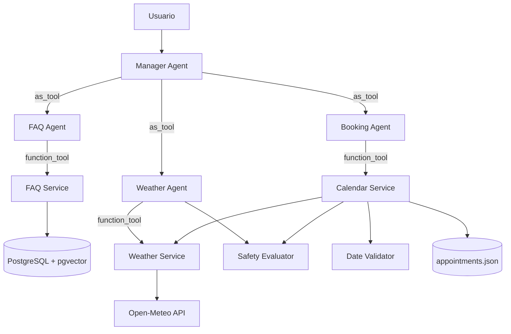

# Arquitectura Centralizada

```mermaid
flowchart TD
    U[Usuario] --> M[Manager Agent]

    M -->|as_tool| FAQ[FAQ Agent]
    M -->|as_tool| W[Weather Agent]
    M -->|as_tool| B[Booking Agent]

    FAQ -->|function_tool| FS[FAQ Service]
    FS --> PG[(PostgreSQL + pgvector)]

    W -->|function_tool| WS[Weather Service]
    WS --> OM[Open-Meteo API]
    W --> SE[Safety Evaluator]

    B -->|function_tool| CS[Calendar Service]

    CS --> DV[Date Validator]
    CS --> WS
    CS --> SE
    CS --> AJ[(appointments.json)]
```