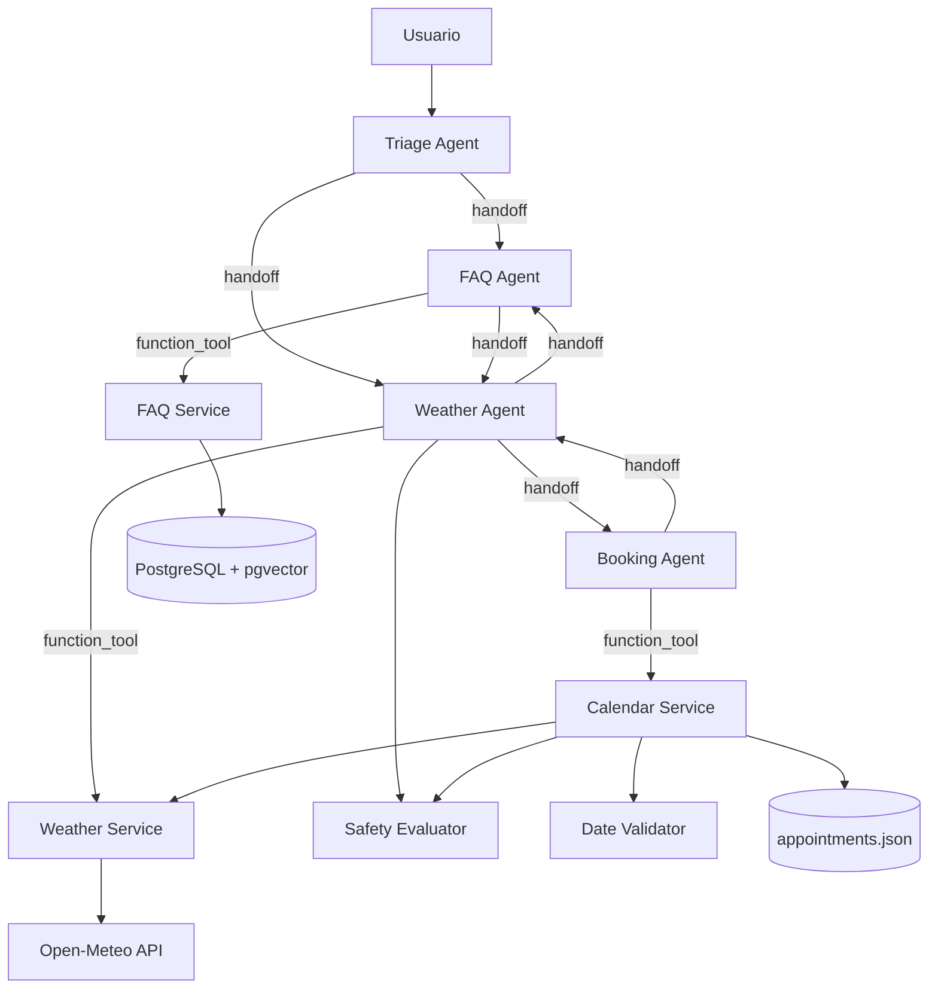

# Arquitectura Descentralizada

```mermaid
flowchart TD
    U[Usuario] --> T[Triage Agent]

    T -->|handoff| FAQ[FAQ Agent]
    T -->|handoff| W[Weather Agent]

    FAQ -->|handoff| W
    W -->|handoff| FAQ
    W -->|handoff| B[Booking Agent]
    B -->|handoff| W

    FAQ -->|function_tool| FQS[FAQ Service]
    FQS --> PG[(PostgreSQL + pgvector)]

    W -->|function_tool| WS[Weather Service]
    WS --> OM[Open-Meteo API]
    W --> SE[Safety Evaluator]

    B -->|function_tool| CS[Calendar Service]
    CS --> DV[Date Validator]
    CS --> WS
    CS --> SE
    CS --> AJ[(appointments.json)]
```