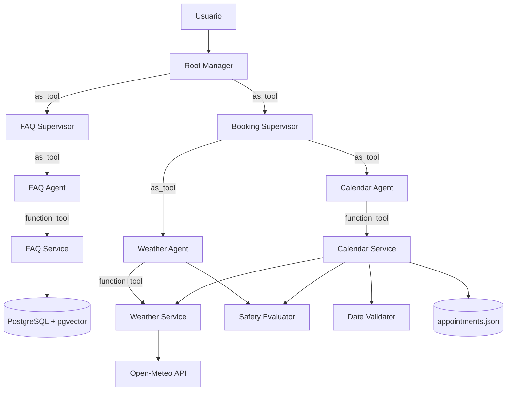

# Arquitectura Jerárquica

```mermaid
flowchart TD
    U[Usuario] --> RM[Root Manager]

    RM -->|as_tool| FSUP[FAQ Supervisor]
    RM -->|as_tool| BSUP[Booking Supervisor]

    FSUP -->|as_tool| FAQ[FAQ Agent]

    BSUP -->|as_tool| W[Weather Agent]
    BSUP -->|as_tool| C[Calendar Agent]

    FAQ -->|function_tool| FQS[FAQ Service]
    FQS --> PG[(PostgreSQL + pgvector)]

    W -->|function_tool| WS[Weather Service]
    WS --> OM[Open-Meteo API]
    W --> SE[Safety Evaluator]

    C -->|function_tool| CS[Calendar Service]
    CS --> DV[Date Validator]
    CS --> WS
    CS --> SE
    CS --> AJ[(appointments.json)]
```